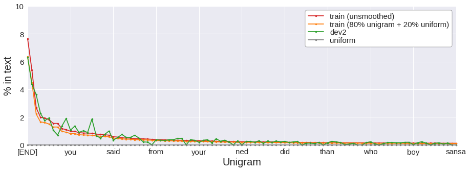

# N-gram language models

Language modeling — that is, predicting the probability of a word in a sentence — is a fundamental task in natural language processing. It is used in many NLP applications such as [autocomplete](https://en.wikipedia.org/wiki/Autocomplete), [spelling correction](https://web.stanford.edu/~jurafsky/slp3/B.pdf), or [text generation](https://openai.com/blog/better-language-models/).

Currently, language models based on neural networks, and especially [transformers](https://en.wikipedia.org/wiki/Transformer_(machine_learning_model)), are the [state of the art](https://paperswithcode.com/task/language-modelling): they predict very accurately the next word based on previous words. However, in this project, I will revisit the most classic of language models: the [**n-gram models**](https://en.wikipedia.org/wiki/N-gram).

## Project structure
* **Part 1:** Unigram model ([code](analysis/part1.ipynb), [write-up](https://medium.com/mti-technology/n-gram-language-model-b7c2fc322799?source=friends_link&sk=d03df89a05762efb92a411874e84fea9))

* **Part 2:** Higher n-gram models ([code](analysis/part2.ipynb), [write-up](https://medium.com/@seismatica/n-gram-language-models-70af02e742ad?source=friends_link&sk=b39f09fd75c0ceee72169177b46ebf3a))

* **Part 3:** Expectation-maximization algorithm to combine n-gram models *(coming soon)*

 